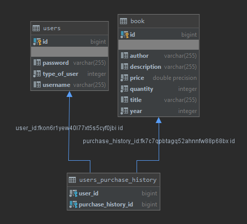

# SYSC4806Project

## Website URL
https://sysc4806project2020.herokuapp.com/

## Current State
#### Project in General
- Integrated with TravisCI and Heroku
- Can create (add), view, and search for books
- Can login to account to buy or sell books
- Can add books to cart for purchase
- Can purchase books books in the cart
- Can show purchase history of user
- Uses PostgreSQL for a persistent database
- Integrated with Kafka for logging

#### Classes
- Book: Create books with id (auto generated), **title**, **author**, **price**, description, year and quantity (**Bolded the mandatory ones**)
- User: Creates user with id (auto generated), **username**, **password**, **typeOfUser** and purchaseHistory (**Bolded the mandatory ones**)
- UserRepository: A CrudRepoistory for storing users
- BookRepository: A CrudRepoistory for storing books
- AccessBookStore: main class for our spring application (sets up database if empty)
- BookStoreController: Uses Front Controller to intercept incoming requests, direct the request to the correct view with needed model data and finally processes the data and renders the view to user
- BookStoreErrorController: Handles the determining the error from the error code and displaying it to the user
- ApplicationMsg: It is an enum which holds the error messages
- LoggingLibrary: A library of functions used for logging messages

#### HTML Pages
- addbook: Allows users to add books to the database
- index: Shows all the books in the database (only shows the books mandatory fields)
- viewbook: Shows all the information for a particular book (shows all fields for a particular book)
- viewCart: Shows all the information of the books added to the cart, how much they will cost and has a purchase button
- viewPurchaseHistory: Shows all the information of the books that were purchases 
- error: Displays the error page with the specified error message

#### Tests
- Book class: tests the construction of books
- Book repository: tests saving and retrieving books from the database
- User class: tests the creation of users and looking at users purchase history
- User repository: tests saving and retrieving users by different criteria from the database
- Web controller: tests that the UI of all pages is without errors and contains the correct information
- Error controller: tests that the UI of the error page is without errors and contains the correct information

## Schema

## To Do Next Sprint
- Create a cart object to represent books in the cart
- Allow the tables in the UI to be sorted
- Work on the presentation
- Display number of items in the cart
- Add a review system for books
- Restrict webpages to logged in users
- Add more kafka logging
- Add a receipt class for purchased books

