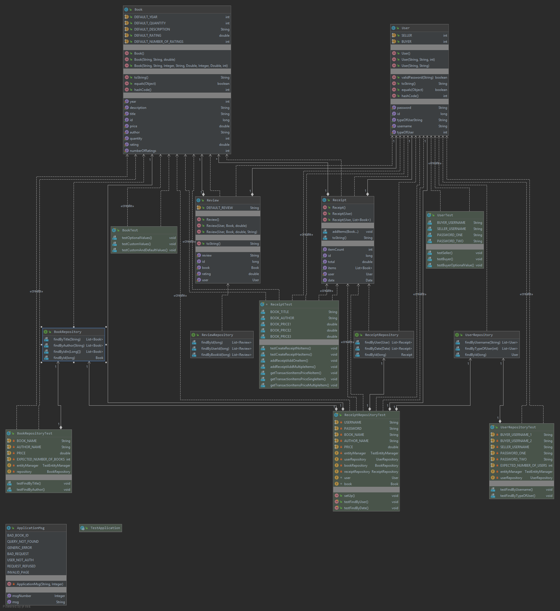
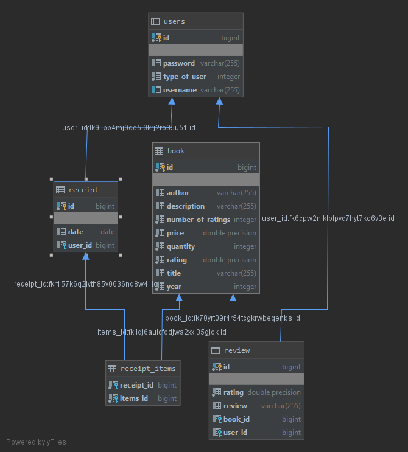

# SYSC4806Project

## Website URL
https://sysc4806project2020.herokuapp.com/

## Website Usage Guide
### Signing In
1. Navigate to the [homepage](https://sysc4806project2020.herokuapp.com/)
2. Click the "Log In" button
3. Use an existing account
	1. Username "buyer" and password "buyer123" for a Buyer account
	2. Username "seller" and password "seller123" for a Seller account
4. Create a new account
	1. Click "Sign Up"
	2. Enter a username/password and select whether you are a Buyer or Seller
	3. Click "Submit"
	4. Click "Log In" and enter your new information
5. Enter your username and password and click "Submit"

### Viewing Book Details
1. From the [homepage](https://sysc4806project2020.herokuapp.com/)
2. Click a particular book title to see the detailed view of that book
3. Alternatively, in the corresponding search box, search either by author or title, to view all the books which match the search

### Purchasing Books
1. Either from the [homepage](https://sysc4806project2020.herokuapp.com/) or the detailed biew of a book
2. Click the "Add to Cart" button for any number of books
3. Click the "View Cart" button
4. Adjust the quantities for any of the books
5. Click "Remove Book" to remove the corresponding book from the cart
6. Click "Purchase" to submit an order
7. This will take you to your purchase history (which can also be viewed by clicking the "View Purchase History" button)
8. Click on a transaction number to see the specific order details

### Adding a Book To Seller
1. You must be logged in as a Seller account
2. Click the "Add a new book" button
3. Fill in the information for the book
4. Click the submit button
5. The new book will appear at the bottom of the list on the homepage, and will be searchable
	

## Current State
#### Project in General
- Integrated with TravisCI and Heroku
- Can create (add), view, and search for books
- Can login to account to buy or sell books
- Can add books to cart for purchase
- Can purchase books books in the cart
- Can show purchase history of user
- Can view reviews and the overall rating for books
- Uses PostgreSQL for a persistent database
- Integrated with Kafka for logging

#### Classes
- Book: Create books with id (auto generated), **title**, **author**, **price**, description, year and quantity (**Bolded the mandatory ones**)
- User: Creates user with id (auto generated), **username**, **password**, **typeOfUser** and purchaseHistory (**Bolded the mandatory ones**)
- Review: Creates review with id (auto generated), **user**, **book**, **rating**, review (**Bolded the mandatory ones**)
- Receipt: Creates receipt with id (auto generated), **user**, **list of books bought** (**Bolded the mandatory ones**)
- UserRepository: A CrudRepoistory for storing users
- BookRepository: A CrudRepoistory for storing books
- ReviewRepository: A CrudRepoistory for storing reviews
- ReceiptRepository: A CrudRepoistory for storing receipts
- AccessBookStore: main class for our spring application (sets up database if empty)
- BookStoreController: Uses Front Controller to intercept incoming requests, direct the request to the correct view with needed model data and finally processes the data and renders the view to user
- BookStoreErrorController: Handles the determining the error from the error code and displaying it to the user
- ApplicationMsg: It is an enum which holds the error messages
- LoggingLibrary: A library of functions used for logging messages

#### HTML Pages
- addbook: Allows users to add books to the database
- index: Shows all the books in the database (only shows the books mandatory fields)
- viewbook: Shows all the information for a particular book (shows all fields for a particular book)
- viewCart: Shows all the information of the books added to the cart, how much they will cost and has a purchase button
- viewPurchaseHistory: Shows all the information of the books that were purchases 
- error: Displays the error page with the specified error message
- signup: Provides a form to create a new account
- viewTransaction: Allows the user to view a particular transaction
- viewReceiptHistory: Allows the user to view a summary of all of their orders
- viewReviews: Shows all of the reviews for a particular book

#### Tests
- Book class: tests the construction of books
- Book repository: tests saving and retrieving books from the database
- User class: tests the creation of users and looking at users purchase history
- User repository: tests saving and retrieving users by different criteria from the database
- Receipt class: tests the construction of receipts
- Receipt repository: tests the persisting of receipt objects in a database
- Web controller: tests that the UI of all pages is without errors and contains the correct information
- Error controller: tests that the UI of the error page is without errors and contains the correct information

## UML

## Schema

## Setting up Kafka
 1. Download and start Kafka as detailed [here](https://kafka.apache.org/quickstart).
 2. Create the necessary topics (Refer to Step 3 of the linked guide), named as follows:
	1. add_book
	2. purchase
	3. error
	4. new_user
 3. Start a consumer for each of the topics (as in Step 5 of the linked guide). Note that each one should be in a seperate terminal.
 4. In the application.properties file, set the value of kafka.logging to "true".
 5. If you are running Kafka on a machine that's not running the application set the IP address in the spring.kafka.bootstrap-servers value to that of the machine with Kafka.
 6. Use the application as normal, any logged messages will appear in the terminal for the corresponding topic.

