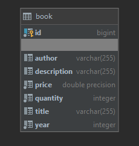

# SYSC4806Project

## Website URL
https://sysc4806project2020.herokuapp.com/

## Current State
#### Project in General
- Integrated with TravisCI and Heroku
- Can create (add), view, and search for books
- Uses PostgreSQL for a persistent database
- Researched Kafka, DataDog and Splunk

#### Classes
- Book: Create books with id (auto generated), **title**, **author**, **price**, description, year and quantity (**Bolded the mandatory ones**)
- BookRepository: A CrudRepoistory for storing books
- AccessBook: main class for our spring application (sets up database if empty)
- BookStoreController: Uses Front Controller to intercept incoming requests, direct the request to the correct view with needed model data and finally processes the data and renders the view to user

#### HTML Pages
- addbook: Allows users to add books to the database
- index: Shows all the books in the database (only shows the books madatory fields)
- viewbook: Shows all the information for a particular book (shows all fields for a particular book)

#### Tests
- Book class: tests the construction of books
- Book repository: tests saving and retrieving books from the database

## Schema
#### Book

## To Do Next Sprint
- Basic integration with one of Kafka, datadog or Splunk into the project (most likely Kafka)
- Add a Users class (Buyer and Seller)
- Ability to Purchase books
- Update the readme and schema
